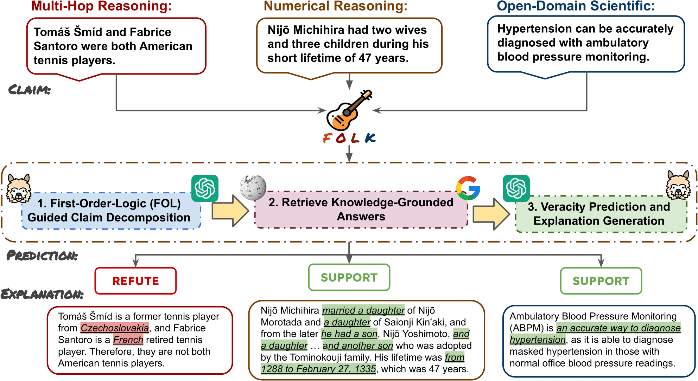

# FOLK: First-Order-Logic (FOL) Guided Knowledge-Grounded Reasoning for Claim Verification

**Code and data will be released here upon acceptance**
FOLK is a claim verification model that can verify complex claims and generate explanations without the need for annotated evidence using Large Language Models (LLMs).

## FOLK Overview



## Installation

Requires Python 3.9 to run.

Install conda environment from `environment.yml` file.

```sh
conda env create -n folk --file environment.yml
conda activate folk
```

Create folder to store trained models under project directory:

```sh
mkdir trained_models
```

## To Run

To decompose claims:

```sh
python decompose.py \
    --dataset ["hover", "feverous", "scifact"] \
    --hover_num_hop ["two", "three", "four"] \
    --feverous_challenge ["numerical", "reasoning", "table"] \
    --prompt_strategy ["direct", "cot", "self-ask", "logic"] \
    --model ["llama-7b", "llama-13b", "llama-30b", "text-davinci"] \
    --version "DEFINE YOUR VERSION" \
    --max_token 1024 \
    --temperature 0.7
```

To ground answers:

```sh
python groudning.py \
    --dataset ["hover", "feverous", "scifact"] \
    --hover_num_hop ["two", "three", "four"] \
    --feverous_challenge ["numerical", "reasoning", "table"] \
    --prompt_strategy ["direct", "cot", "self-ask", "logic"] \
    --model text-davinci \
    --model ["llama-7b", "llama-13b", "llama-30b", "text-davinci"] \
    --version "DEFINE YOUR VERSION" \
```

To make predictions:

```sh
python aggregate.py \
    --dataset ["hover", "feverous", "scifact"] \
    --hover_num_hop ["two", "three", "four"] \
    --feverous_challenge ["numerical", "reasoning", "table"] \
    --prompt_strategy ["direct", "cot", "self-ask", "logic"] \
    --model ["llama-7b", "llama-13b", "llama-30b", "text-davinci"] \
    --version "DEFINE YOUR VERSION" \
    --max_token 1024 \
    --temperature 0.7
```

To evaluate:

```sh
python evaluation.py \
    --dataset hover \
    --hover_num_hop three \
    --prompt_strategy logic \
    --model text-davinci \
    --version "V1.0"
```

## Reference
